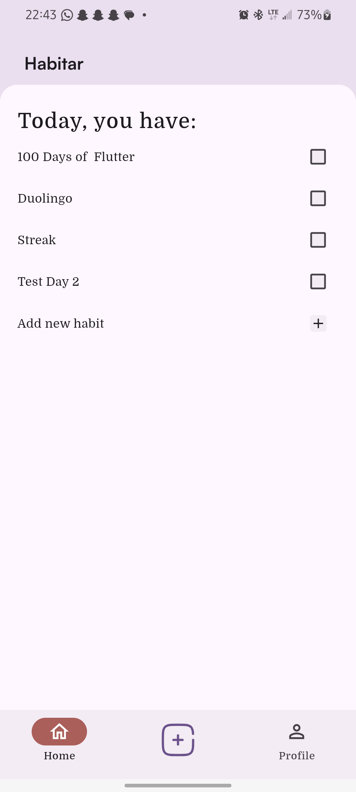
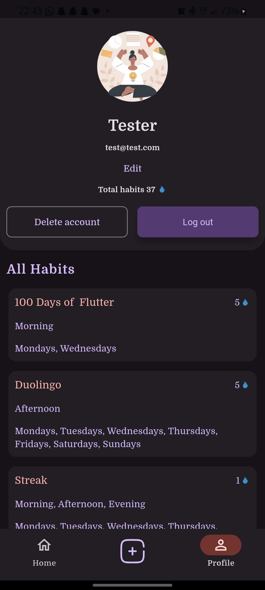

<p align="center">
  <a href="https://appetize.io/app/b_nqcolhpm3blzmlb3eripogqzaa?device=pixel7&osVersion=13.0&toolbar=true"
     target="_blank"
     rel="nofollow noopener noreferrer"
     aria-label="Live Demo">
    <strong><u>Live Demo 🚀</u></strong>
  </a>
</p>

# 🌱 Habitar

**Habitar** is a **cross-platform habit-tracking application** built with **Flutter**, designed to promote habit consistency through smart reminders and offline-first data access.

The app follows **Clean Architecture** and uses modern state management for scalability, reliability, and maintainability.

---

## 🧠 Core Technologies

* **State Management**

  * [BLoC]
  * [Hydrated Bloc]
  * [Flutter Super]

* **Backend & Services**

  * Firebase Authentication
  * Cloud Firestore
  * Firebase Crashlytics

* **Local Storage**

  * [Drift] (offline-first database)

* **Notifications**

  * [flutter_local_notifications] (custom reminders for Android & iOS)

---

## 📸 Screenshots

<p align="center">
  
  &nbsp;&nbsp;&nbsp;
  
</p>

---

## ▶️ First Run

Install dependencies:

```bash
flutter pub get
```

Run code generation:

```bash
flutter pub run build_runner build
```

---

## 🔌 ApiService Layer

An abstraction over Firebase communication.
All network calls return either **DataSuccess** or **DataFailed**, both implementations of the abstract **[DataState]** class.

### Services

* **[AuthApiService]**
  Handles Firebase Authentication logic

* **[HomeApiService]**
  Manages habits and Firestore interactions

* **[DataState]**
  Generic wrapper for success and error responses

---

## 📦 Dependency Management

Dependencies are managed via a service locator:

* File: **[`service_locator.dart`][service_locator]**
* Tool: **[GetIt]** (lightweight dependency injection)

---

## 🧩 App Features & Architecture

The app is structured into **four main features**:

* [Splash]
* [Choose Mode]
* [Auth]
* [Home]

Each feature follows **Data → Domain → Presentation** separation.

---

### 🚀 Splash

* Displays splash screen
* Checks user authentication state
* Routes accordingly after a **1-second delay**

---

### 🎨 Choose Mode

* Stores theme preference (light / dark) using **Hydrated Bloc**
* Defaults to the device’s system theme
* Applied globally in the main app widget

---

### 🔐 Auth

Handles user authentication.

**Structure:**

* **Data:** Models, repository implementation, [AuthApiService]
* **Domain:** Entities, repository definitions, authentication use cases
* **Presentation:** Bloc, events, states, widgets, and 4 auth screens

📁 Path: [Auth]

---

### 🏠 Home

Manages habits and reminders.

**Structure:**

* **Data:**

  * Models
  * Repository implementation
  * [Drift] database
  * Notification logic
  * [HomeApiService]

* **Domain:**

  * Entities
  * Repository definitions
  * Habit-related use cases (add, delete, update)

* **Presentation:**

  * [Flutter Super] state classes
  * Habit UI widgets
  * 5 habit interaction screens

📁 Path: [Home]

---

## 🐞 Logger

The project uses **Firebase [Crashlytics]** to log errors and app crashes in production.

---

## 🔮 Future Recommendations

* Automatically **cancel all scheduled notifications** for a specific day once a habit is marked as completed
* This may require **reworking notification ID generation**

---

## 🔗 References

[BLoC]: https://pub.dev/packages/flutter_bloc
[Hydrated Bloc]: https://pub.dev/packages/hydrated_bloc
[Flutter Super]: https://pub.dev/documentation/flutter_super/latest/
[authentication]: https://pub.dev/packages/firebase_auth/
[cloud storage]: https://pub.dev/packages/cloud_firestore/
[crashlytics]: https://pub.dev/packages/firebase_crashlytics/
[drift]: https://pub.dev/packages/drift/
[flutter_local_notifications]: https://pub.dev/packages/flutter_local_notifications/
[AuthApiService]: lib/features/auth/data/sources/auth_service.dart
[HomeApiService]: lib/features/home/data/sources/home_service.dart
[DataState]: lib/core/res/data_state.dart
[service_locator]: ./lib/service_locator.dart
[GetIt]: https://pub.dev/packages/get_it
[Auth]: lib/features/auth
[Home]: lib/features/home

---

If you want, I can:

* Convert this into a **clean architecture case study**
* Create a **one-page recruiter-friendly summary**
* Add **architecture diagrams** or **data flow visuals**
